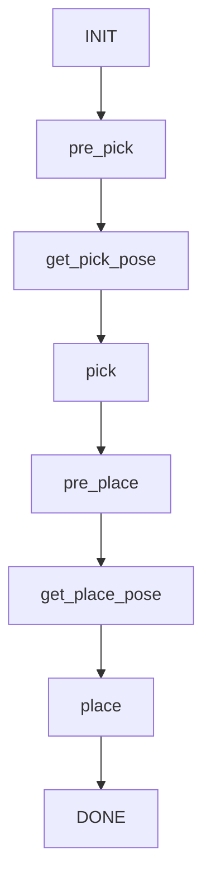

# ur5e_actual
ur5e_actual

### 1. Requirements
System: Ubuntu 18.04, Ubuntu 20.04   

ROS: Melodic, Noetic    
 
Moveit(1st version)


### 2. Other Dependencies
For some dependencies that were missed for the project, please check the following instructions.
```
sudo apt-get install ros-melodic-moveit-visual-tools
sudo apt-get install ros-melodic-ros-controllers
sudo apt-get install ros-melodic-ros-control
sudo apt-get install ros-melodic-joint-trajectory-controller
sudo apt-get install ros-melodic-position-controllers
sudo apt-get install ros-melodic-velocity-controllers
sudo apt-get install ros-melodic-hardware-interface
sudo apt-get install ros-melodic-ur-client-library
sudo apt-get install ros-melodic-ur-msgs
```

__NOTE: There might be more dependencies needed due to various reasons. If you found any, please let me know.(archer7wang@outlook.com)__


### 3. Software preparation
Like ordinary ros projects, the simulation needs a clean workspace.
```
mkdir -p ur5e_actual_ws/src
cd src
git clone https://github.com/wangarcher/ur5e_actual.git
git clone https://github.com/wangarcher/handeye.git
cd ..
catkin_make
source devel/setup.bash
``` 

### 4. Warning

__At the very beginning, we strongly recommend that any involved personnel should read the [UR5e user manual](https://ur-support-site-cn.s3.cn-northwest-1.amazonaws.com.cn/165903/99419_UR5e_User_Manual_zh_Global.pdf) carefully for fundamental information(especially from page 99 to page 236).__ 

__For technical personnel, please be advised! Any violations of those basic rules might cause severe damage to the UR5e robot and even leads to an immediate decommissioning of the robot!!!__

__For non-technical personnel, please follow the instructions of the operator of the robot when you're on the site. Although the robot would stop its motion when colliding with any kind of obstacle (including you), the impact might cause some physical damage to whom arrogantly ignored the kind of dissuasions and insistently stood in the robot's workspace.__

### 5. Execution Sequence

__Be advised! The current pipeline is logically unfriendly. Any modifications to this workflow might be devastating!__

##### 0. Power up the UR5e robot
Press the power bottom in the UR5e robot panel. And wait, then power on the robot by clicking the red icon in the left bottom corner.

##### 1. Initialization
To connect the UR5e robot with the PC. 
```
roslaunch ur_robot_driver ur5e_bringup_with_ip.launch
```
##### 2. Start the interface
To run the interface
```
roslaunch ur5e_move_group_interface run_arm.launch
```
##### 3. Start the hand-eye driver and easy aruco detection module
To run the interface
```
roslaunch easy_aruco single.launch

```
##### 4. Object visual info filter
To run the interface
```
roslaunch ur5e_perception ur5e_perception.launch
```
##### 5. Plan
To run the project planning node
```
roslaunch ur5e_plan ur5e_project_plan.launch
```

### 6. The flow chart

```
INIT:           Init
pre_pick:       Moving to 1st reco configuration
get_pick_pose:  Get the object pose
pick:           Moving towards to that pose then pick
pre_place:      Moving to 2nd reco configuration
get_place_pose: Get the target pose
place:          Moving towards to that pose then place
DONE:           Done
```
